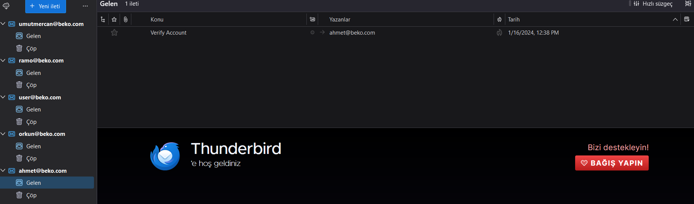
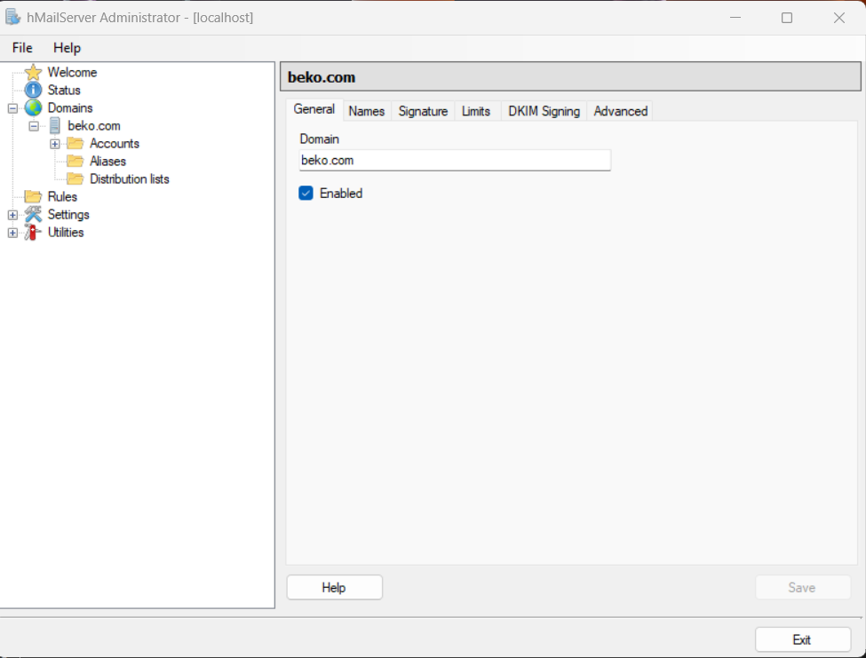
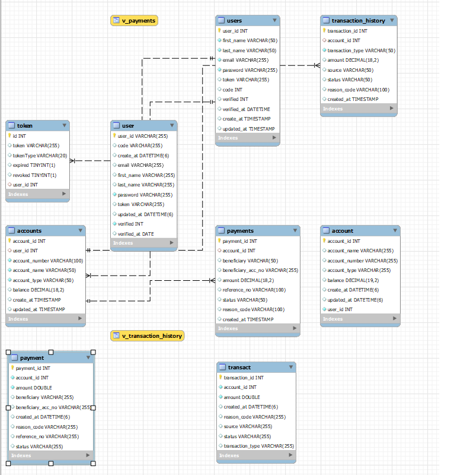
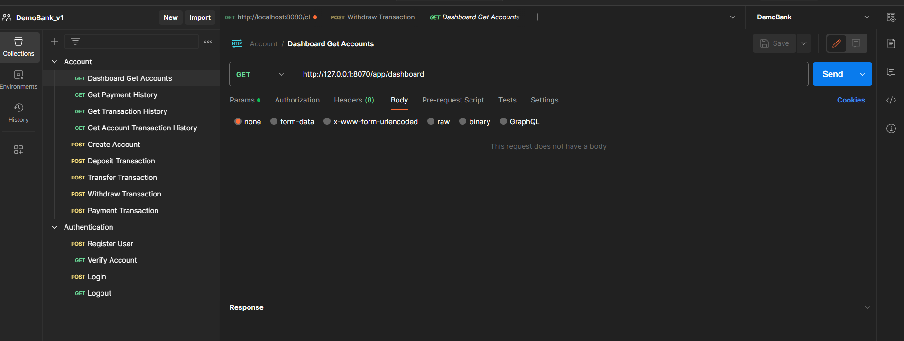

# Spring Boot Online Banking Rest API

This project is a Java Spring Boot Rest API project. MySql is used as the database. JWT, sessions, and interceptors are employed for authentication and authorization. Tests have been conducted using Postman. Users can register and log in to the system. They can open new bank accounts, deposit and withdraw money, transfer money between accounts, and make payments. The project is developed in compliance with code refactoring, design patterns, and SOLID principles

## Features

- It includes Authentication and Authorization mechanisms. 
- Email control and verification mechanisms are also available.
- Rest API
- It adheres to SOLID principles and design patterns.
- Tüm platformlara destek

  
## API Usage

#### Dashboard Get Accounts

```http
  GET /app/dashboard
```

| Headers | Tip     | Açıklama                |
| :-------- | :------- | :------------------------- |
| `Authorization` | `Bearer:{{access_token}}` | **Required** . Your API key. |

#### Get Payment History

```http
  GET /app/payment_history
```

| Headers | Tip     | Açıklama                       |
| :-------- | :------- | :-------------------------------- |
| `Authorization` | `Bearer:{{access_token}}` | **Required** . Your API key. |

#### Get Transaction History


```http
  GET /app/transaction_history
```

| Headers | Tip     | Açıklama                       |
| :-------- | :------- | :-------------------------------- |
| `Authorization` | `Bearer:{{access_token}}` | **Required** . Your API key. |

#### Post Create Account


```http
  POST /account/create_account
```

| Body | Type    | Description                      |
| :-------- | :------- | :-------------------------------- |
| `account_name` | `string` | **Required**  |
| `account_type` | `string` | **Required**  |

| Headers | Type     | Description                    |
| :-------- | :------- | :-------------------------------- |
| `Authorization` | `access_token` | **Required** . Your API key. |

#### Post Deposit Transaction


```http
  POST /transact/deposit
```

| Body | Type    | Description                      |
| :-------- | :------- | :-------------------------------- |
| `deposit_amount` | `string` | **Required**  |
| `account_id` | `int` | **Required**  |

| Headers | Type     | Description                    |
| :-------- | :------- | :-------------------------------- |
| `Authorization` | `access_token` | **Required** . Your API key. |
#### POST Transfer Transaction


```http
  POST /transact/transfer
```

| Body | Type    | Description                      |
| :-------- | :------- | :-------------------------------- |
| `sourceAccount` | `string` |**Required**  |
| `targetAccount` | `string` |**Required**  |
| `amount` | `string` | **Required** |

| Headers | Type     | Description                    |
| :-------- | :------- | :-------------------------------- |
| `Authorization` | `access_token` | **Required** . Your API key. |

#### Post Withdraw Transaction

```http
  POST /transact/withdraw
```
| Headers | Type     | Description                    |
| :-------- | :------- | :-------------------------------- |
| `Authorization` | `access_token` | **Required** . Your API key. |

| Body | Type    | Description                      |
| :-------- | :------- | :-------------------------------- |
| `withdrawal_amount` | `string` | **Required** |
| `account_id` | `string` |**Required**  |


#### Post Payment Transaction

```http
  POST /transact/payment
```
| Headers | Type     | Description                    |
| :-------- | :------- | :-------------------------------- |
| `Authorization` | `access_token` | **Required**. Your API key.. |

| Body | Type    | Description                      |
| :-------- | :------- | :-------------------------------- |
| `beneficiary` | `string` | **Required**  |
| `account_number` | `string` | **Required**  |
| `account_id` | `string` | **Required**   |
| `reference` | `string` | **Required**  |
| `payment_amount` | `string` | **Required** |


#### Get Verify Account


```http
  GET /verify?token={token}&code={code}
```

| Query Params | Value    | Description                    |
| :-------- | :------- | :-------------------------------- |
| `token` | `token` | **Required** . Token from your email |
| `code` | `code` | **Required** . Code from your email |


#### Post Register User


```http
  POST register?confirm_password=1234
```

| Body | Type    | Description                       |
| :-------- | :------- | :-------------------------------- |
| `first_name` | `string` |  **Required**. User email. |
| `last_name` | `string` |  **Required**. User email. |
| `email` | `string` |  **Required**. User email. |
| `password` | `string` |  **Required**. User password. |


#### Post Register Login


```http
  POST /login
```

| Body | Type    | Description                       |
| :-------- | :------- | :-------------------------------- |
| `email` | `string` | **Required** . User email. |
| `password` | `string` | **Required** . User password. |


#### Get Transaction History


```http
  GET /logout
```

| Headers | Type     | Description                    |
| :-------- | :------- | :-------------------------------- |
| `Authorization` | `access_token` | **Required**. Your API key. |

## Email Configurations


I used ThunderBird for email configurations. I created email addresses on Local Host through Hmail Server.



 I saved these email addresses using ThunderBird. That's it.




## Database Structure



## Distribution

1- Clone the project to your local machine.
2- Build and run the application using your preferred Java Development environment.

Start for Project

```bash
  maven build
```

```bash
  maven run
```

  
## application.properties

To run the project, update the following information in your application.properties file.

`spring.datasource.url`

`spring.datasource.username`

`spring.datasource.password`
  
## Tests

Postman


## Technologies

**Framework:** Spring Boot

**Technologies:** MySql, Javax Servlet, Tomcat, Spring Security Crypto, Json Web Token, Interceptors
  
## Related projects

You can take a look at the frontends for my React Redux Online Banking App and Android Java Online Banking App projects for this application.

React Redux Online Banking App Project: [Java Android]( https://github.com/Berko01/Android-Online-Banking-App-With-Java-Spring)

React Redux Online Banking App Project: [React Redux]( https://github.com/Berko01/Advanced-Full-Stack-Project-With-Java-Spring-Boot-And-React-Redux-Online-Banking/tree/master/demo-bank-redux)


  
## Extracted Lessons

Java Spring usage, Enterprise architecture, Database architecture, Session architecture, JWT architecture, Interceptor usage, Exception Handling mechanism, Project configuration, and more.

  
## Programmers

- [@Berko01](https://github.com/Berko01) design and development.

  
